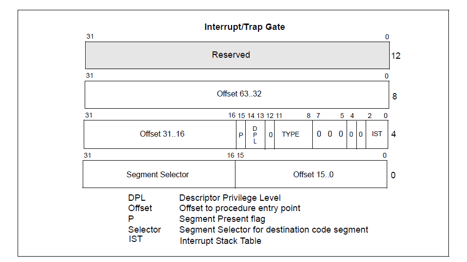
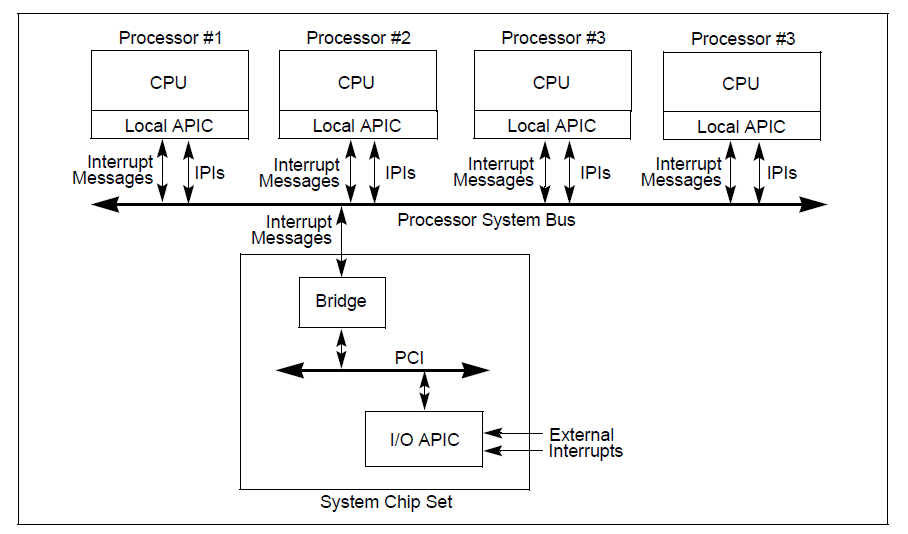
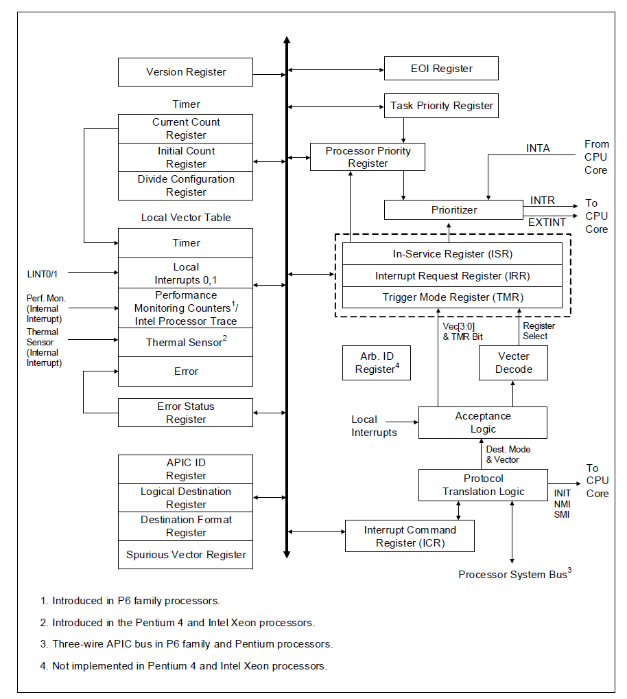

# Прерывания процессора

---
# Прерывания
* Interrupts – события, генерируемые перефирией, отправляются процессору через специальный пин
* Exceptions — события, возникающие во время обработки инструкций: доступ к несуществующей памяти, некорректная кодировка инструкции, etc
* Software interrupts — прерывания, вызываемые инструкцией `int`

---
# Прерывания
* IA-32 определяет 256 прерываний: от 0 до 255
* Прерывания 0-31 используются процессором для architecture-defined exceptions, они часто обозначаются `#PF`, `#GP`, ...
* Прерывания 32-255 можно использовать как угодно
* Прерывания можно временно отключать, для этого существуют инструкции `cli`/`sti`, также можно поменять IF внутри EFLAGS с помощью `pushf`/`popf`

---
# Некоторые exceptions
* #UD (6) — undefined opcode
* #GP (13) — general protection fault
* #PF (14) — page fault
* ...

---
# Fault vs trap, error code
* Fault возникает *во время исполнения* инструкции; после возврата из обработчика, инструкция исполняется заново
* Trap возникает *сразу после исполнения* инструкции; после возврата из обработчика, начнёт выполняться *следующая* инструкция
* Также некоторые исключения код ошибки, он имеет разные значения для разных исключений

---
# Double fault
* Если исключение случилось во время обработки исключения, возникает double fault
* Double fault можно обработать (#DF, 8), однако вернуться в предыдущий контекст нельзя
* Если во время обработки double fault происходит ещё одно исключение, то процессор переходит в специальный режим: shutdown mode
* Иногда это называют triple fault

---
# NMI
* Non-maskable interrupts
* Используются для сообщения очень срочных вещей процессору: например, ошибки памяти
* IF никак не влияет на их появление
* Nested NMI запрещены

---
# Interrupt Descriptor Table (IDT)
* ISDM, Volume 3A, 6.10
* Синонимы: interrupt vector, вектор прерываний
* Аналогично GDT содержит в себе дескрипторы — gate descriptors
* Task gate, interrupt gate и trap gate
* Загрузка IDT происходит аналогично GDT: описывается 6 байтный IDT pointer, затем вызывается `lidt`

---
# Interrupt Descriptor Table (IDT)

---
# Обработка прерывания
* При входе в обработчик прерывания, процессор прыгает в указанное место, сохраняя на стеке текущее состояние процессора
* Обратите внимание, что место прыжка задаётся *виртуальным* адресом, поэтому обработчики прерываний всегда должны быть подмаплены в текущее адресное пространство
* Т.к. прерывание происходит после любой инструкции, мы не можем полагаться на calling conventions, необходимо сохранять все регистры, а затем их восстанавливать
* Для выхода из обработчика используется `iret`
* Interrupt gate (в отличие от trap gate) выставляет IF=0 перед входом в обработчик, запрещая interrupt in interrupt

---
# Interrupt stack frame

---
# APIC
* Контроллер прерываний, ISDM, Vol. 3A, 10
* Local APIC = LAPIC, размещается на кристалле процессора, один на ядро
* I/O APIC принимает сигналы от переферии и перенаправляет их в ядра процессора
* Inter-processor interrupts = IPIs
* APIC Timer

---
# APIC

---
# LAPIC
* Управляется через специальный регион памяти, memory-mapped IO = MMIO
* Для каждого ядра адрес один, но LAPIC разный
* Базовый адрес можно найти через MSR `IA32_APIC_BASE`
* Local vector table (LVT) описывает как обслуживаются различные прерывания: edge/level triggered, mask/unmask
* EOI — окончание текущего прерывания

---
# LAPIC

---
# IOAPIC
* Не описывается в ISDM
* [Cпецификация](https://pdos.csail.mit.edu/6.828/2016/readings/ia32/ioapic.pdf), которую сложно найти и легко потерять :)
* Основан на 82093AA I/O APIC (90-ые)
* Как и LAPIC, управляется с помощью MMIO
* Базовый адрес обычно находят через таблицы ACPI

---
# ACPI
* Advanced Configuration and Power Interface
* Стандарт, который описывает, как работать с переферией и как управлять питанием
* APICA = ACPI Component Architecture — открытая реализация ACPI
* Чтобы интегрировать APICA в вашу ОС нужно реализовать специальный интерфейс — OSL (OS interface layer)
* Нас пока будут интересовать только ACPI таблицы
* RSDP (Root System Description Table) -> XSDT (eXtended System Descriptor Table) -> MADT (Multiple APIC Description Table)

---
# ありがとう!
