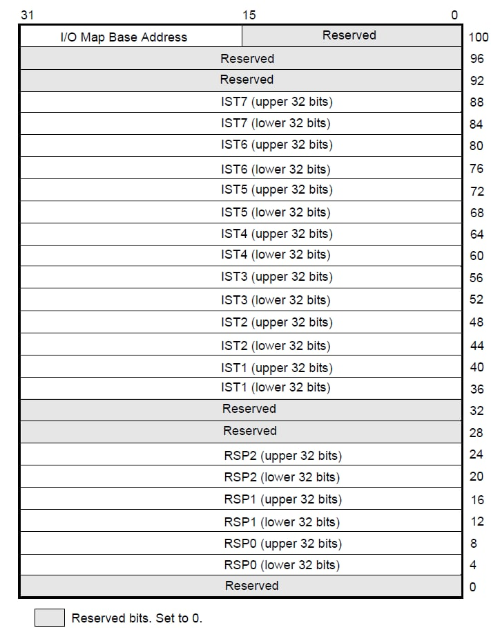
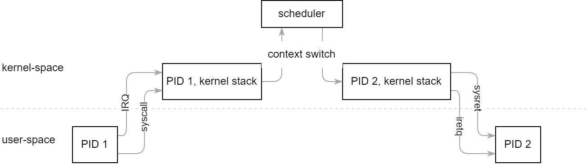

<style>
img[alt~="center"] {
  display: block;
  margin: 0 auto;
}
</style>

# Процессы

---

# Software interrupts
* Ещё один вид прерываний, вызываемые специальными инструкциями
* `int X`, `int3`, `into`, `int1`

---

# CPL, DPL и RPL
* CPL (current privilege level) – текущий уровень привилегий, определяется регистром `cs`
* DPL (descriptor privilege level) – уровень привилегий, откуда доступен сегмент (например, DPL в IDT определяет уровень привилегий для софтварных прерываний)
* RPL (requested privilege level) — то, что записывается в нижние биты segment selector

---

# TSS
* Task-state segment
* В protected mode может использоваться для hardware multitasking
* В 64-bit mode используется для хранения информации
* В современных ОС требутся заводить по одному TSS на ядро процессора

---



---

# Stack switching
* Если при входе в прерывание меняется CPL, то процессор изменяет RSP на соответсвующий новому CPL в TSS
* `RSP0` для ring0, `RSP1` для ring1, итд
* Если CPL не изменяется, то RSP не меняется и фрейм прерывания кладётся прямо на текущий стек

---

# Interrupt stack table
* IST появился впервые в 64-bit mode
* Позволяет прерываниям назначать отдельный стек при входе (переключается безусловно)
* Какой стек выбрать описывается в IDT (3 бита)
* 0 зарезервирован — обозначает то, что прерывание должно использовать старый механизм переключения стека

---

# Процессы, системные вызовы и переключение контекста

---

# Что такое процесс?

---

# Что такое процесс?
* Процесс — это «запущенная программа», исполняемая процессором
* Результат загрузки программы из исполняемого файла называется *образом* (image)
* Контекст исполнения: RIP, EFLAGS, RSP, etc
* Адресное пространство
* Ресурсы ОС: файловые дескрипторы, сокеты итд

---

# Процессы и треды
* Внутри процесса может быть несколько потоков
* Удобно представлять процесс как группу тредов, разделяющих одно адресное пространство и некоторые другие ресурсы
* В Linux треды называются тасками и описываются `struct task_struct`

---

# Состояния процесса


---

# User-space и kernel-space
* После перехода в обработчик системного вызова, процесс находится в kernel-space
* Ядро использует выделеный per-task стек небольшого размера — kernel stack
* В kernel-space тоже могут возникать прерывания, поэтому в критических местах их нужно отключать

---

# Системные вызовы
* Процессы изолированы от периферии, поэтому нужен способ взаимодействия с операционной системой
* Системные вызовы — это API для ОС

---

# Системные вызовы: `int 0x80`
* 32-bit linux для системных вызовов использует программное прерывание 128 (0x80)
* В `eax` передаётся номер системного вызова
* Аргументы передаются через регистры (по порядку): `ebx`, `ecx`, `edx`, `esi`, `edi`
* Прерывания — медленный механизм: проверки на стороне процесса

---

# Системные вызовы: `sysenter/sysexit`
* Вариант Intel
* AMD поддерживает только в 32 bit mode
* IA32_SYSENTER_CS задаёт описание «виртуального» code segment: он не описывается в GDT/LDT, а имеет константные значения
* `IA32_SYSENTER_ESP` — стек при заходе в ядро
* `IA32_SYSENTER_EIP` — адрес точки входа
* Не является частью ABI ядра

---

# Системные вызовы: `syscall/sysret`
* Изначально придуман AMD
* Intel поддерживает только в 64 bit mode
* `IA32_LSTAR` — адрес точки входа
* `IA32_STAR` аналогично `IA32_SYSENTER_CS`
* `rip -> rcx`, `rflags -> r11`
* Аргументы передаются через регистры (по порядку): `rdi`, `rsi`, `rdx`, `r10`, `r8`, `r9`

---

# Переключение контекста

---


---
# Переключение контекста: `schedule`
```c
void schedule() {
    // called from task A
    struct task* next = select_next_task();
    switch_context(current, &next);
    // already in task B
    vmem_switch_to(next->vmem);
    restore_fpu(next->fpu_ctx);
    // ...
}
```

---

# Переключение контекста: `switch_context`
* Основная магия
* Переключает процесс на другой ядерный стек
* Можно не сохранять все регистры, только callee-saved, т.к. компилятор знает, что вызывает функцию, => уже сохранит нужный ему контекст

---

# Переключение контекста: `switch_context`
```x86asm
// rdi points to current context
// rsi points to next context
switch_context:
    push rbp
    push rbx
    // ...

    // save current stack
    mov qword ptr [rdi], rsp

    // restore next stack
    mov rsp, qword ptr [rsi]

    // ...
    pop rbx
    pop rbp
    ret
```

---

# На этом всё!
