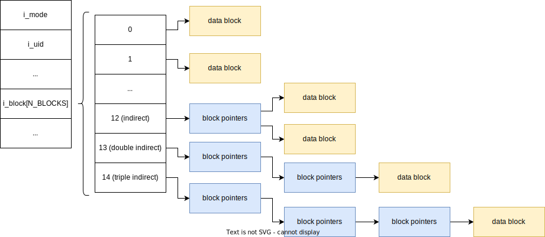

# Блочные устройства, файловые системы и VFS

---

# Символьные устройства
* Character device
* Поддерживают ввод/вывод последовательно
* Более корректное название — последовательные или стриминговые устройства
* Примеры: звуковые и сетевые карты, клавиатуры

---

# Блочные устройства
* Block device
* Обычно обслуживают какие-то хранилища информации
* Позволяют читать произвольное место внутри себя, а не только последовательно
* Всё пространство разделено на *блоки*
* Размер блока определяется драйвером устройства, но должен быть степенью двойки и не более размера страницы

---

# ext2
* Разработана в середине 90-ых
* Диск разбивается на блоки, размер блока указывается при создании и не может быть изменён, обычно 4Кб
* Блоки объединяются в *группы блоков*
* Каждая такая группа блоков хранит специальный *суперблок*, содержащий в себе метаданные всей файловой системы
* Каждая группа имеет т.н. *block group descriptor*, в нём хранится информация о группе
* Для избыточности суперблок и дескрипторы всех групп хранятся внутри каждой группы

---

# ext2: inodes
* [Код](https://elixir.bootlin.com/linux/v5.17.5/source/fs/ext2/ext2.h#L301)
* inode – это структура, представляющая файл на диске
* Размер ~128 байт
* inode имеет свой уникальный номер
* Имя файла может меняться, но его inode не меняется
* Хранятся непрерывным массивом внутри inode table

---

# ext2: inodes

---

# ext2: block group

---

# ext2: superblock & block group descriptor
* [Структура суперблока](https://elixir.bootlin.com/linux/v5.17.5/source/fs/ext2/ext2.h#L415)
* [Структура block group descriptor](https://elixir.bootlin.com/linux/v5.17.5/source/fs/ext2/ext2.h#L202)

---

# ext2: directories, hard links & symlinks
* Каждая директория – отдельная inode
* Вместо данных файла там хранятся специальные [структуры](https://elixir.bootlin.com/linux/v5.17.5/source/fs/ext2/ext2.h#L583)
* Жёсткие ссылки – разные названия одной и той же inode
* Жёсткие ссылки не могут «протухнуть», они всегда ссылаются на существующий файл
* Символические ссылки – «указатель» на файл, внутри inode (в `i_block`) пишется имя файла (если не помещается – выделяется целый блок)

---

# ext2: e2fsck
* Специальная программа, которая проверяет ext2 на валидность
* Вызывается раз в несколько mount'ов
* Если ФС отмонтирована некорректно или e2fsck обнаруживает неконсистентность, производится file system repairing
* Это очень долгий процесс, читающий очень много блоков на дисках

---

# ext3
* Что будет, если диск даст сбой посреди записи в файл?
* Современные диски огромные и читают медленно, поэтому e2fsck может занимать *часы*
* Как быть?

---

# ext3: journaling
* Давайте выделим специальное место на диске – *journal*
* Перед тем, как изменить файловую систему, все операции изменения записываются в журнал, в конец добавляется маркер конца транзакции
* Если сбой происходит *во время* записи транзакции в журнал – маркер не запишется, транзакция пропадёт
* Если сбой происходит *после* записи транзакции, но до того, как все данные запишутся на диск, транзакцию можно будет повторить ещё раз
* ***NB***: Атомарность гарантируется на уровне `write(3)`

---

# ext4
* 2008 год
* Обратно-совместима с ext3
* Появляются чексуммы журнала и метаданных
* 2038 year problem => 64 bit timestamps
* Pre-allocation: выделение пустого места в файле без записи в него нулей
* Delayed allocations: место на диске выделяется не сразу при записи, а при flush
* Extents: вместо схемы с блоками появляется extent tree – аналогичная структура, но позволяет маппить не по одному блоку, а сразу несколько

---

# VFS
* Абстракция над несколькими файловыми системами
* Т.к. по идеологии Unix все файловые системы должны располагаться в одном пространстве имён
* Специальный интерфейс внутри ядра, который реализуется всеми файловыми системами

---

# VFS

---

# Page cache
* Кэш страниц, которые выдаются *backing store* – низлежащим блочным хранилищем
* Именно поэтому размер блока должен быть не более, чем размер страницы
* Если в page cache нет нужной страницы, происходит major fault и она зачитывается с диска
* Записи происходят напрямую в page cache, а затем асинхронно пишутся на диск (write-back strategy)

---

# I/O schedulers
* Шедулер операций к диску
* В самой элементарной форме представляет собой очередь
* Когда в очередь добавляется запрос, он мёржится с своими соседями, которые читают соседние сектора
* Исторически называются *elevators* (по аналогии с алгоритмом для лифтов)

---

# I/O schedulers: deadline
* Самый простой шедулер может вызывать disk read starvation
* Deadline шедулер состоит из трёх очередей: read, write и deadline
* read/write также сортируются и мёржатся по секторам
* deadline – обычная очередь запросов, все запросы туда добавляются, а также указывается deadline на чтение (несколько миллисекунд)
* Если самый первый запрос в deadline queue уже просрочен, он выполняется
* Иначе шедулер следующий запрос берётся из read/write очередей

---

# I/O schedulers: completly fair-share
* Каждому процессу выделяется отдельная очередь, внутри которой запросы сортируются и мёржатся
* Запросы достаются шедулером из каждой очереди последовательно (round-robin)
* Называется «честным», т.к. даёт равное количество i/o time каждому процессу
* [BFQ](https://www.kernel.org/doc/html/latest/block/bfq-iosched.html) – более продвинутая версия CFQ
